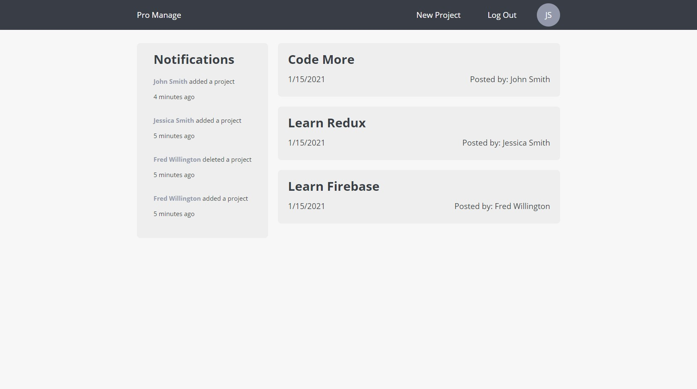
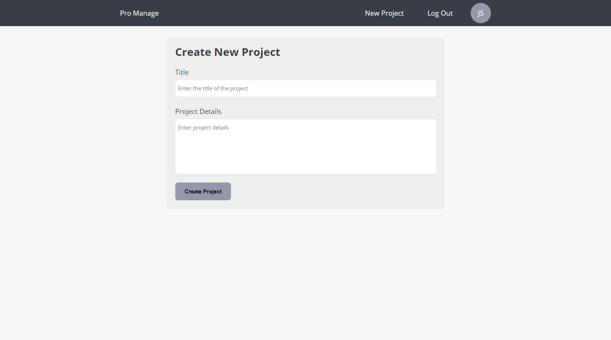
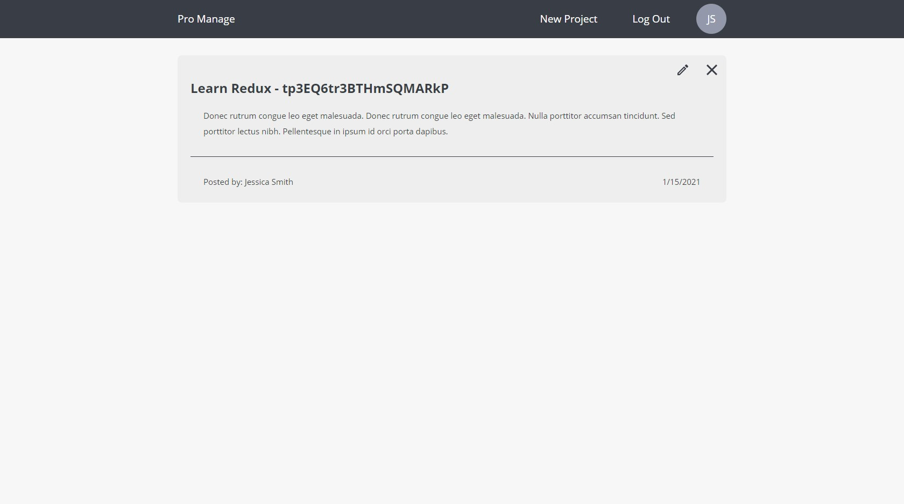

## Pro Manage - Project Management Tool (React, Redux, Firebase)
This single page application was developed as a learning project. 

Pro Manage is a project management tool to provide users with an easy way to track, manage and collaborate on projects from a centralized dashboard. 

## Motivation
The motivation for building this project was as a learning project. I wanted to develop hands on experience with Redux and Firebase/Firestore.

## Screenshots






## Tech/framework used
<b>Built with</b>
- React
- Redux/React-Redux
- Firebase/Firestore
- React Router

## How To Run
<b>Within project folder:<b>
```shell
npm start
```

<b>Allowed Users<b>
As the project will not be put into production, a user has been registered with limited functionality to allow viewing of application:
 - email: john@gmail.com pass: john123

## Contribute
This project was developed as a learning project and will not be maintained going forward.

## Credits
Inspired by The Net Ninja 
https://github.com/iamshaunjp/React-Redux-Firebase-App


## License
MIT © [Jimmy Figliomeni]()
